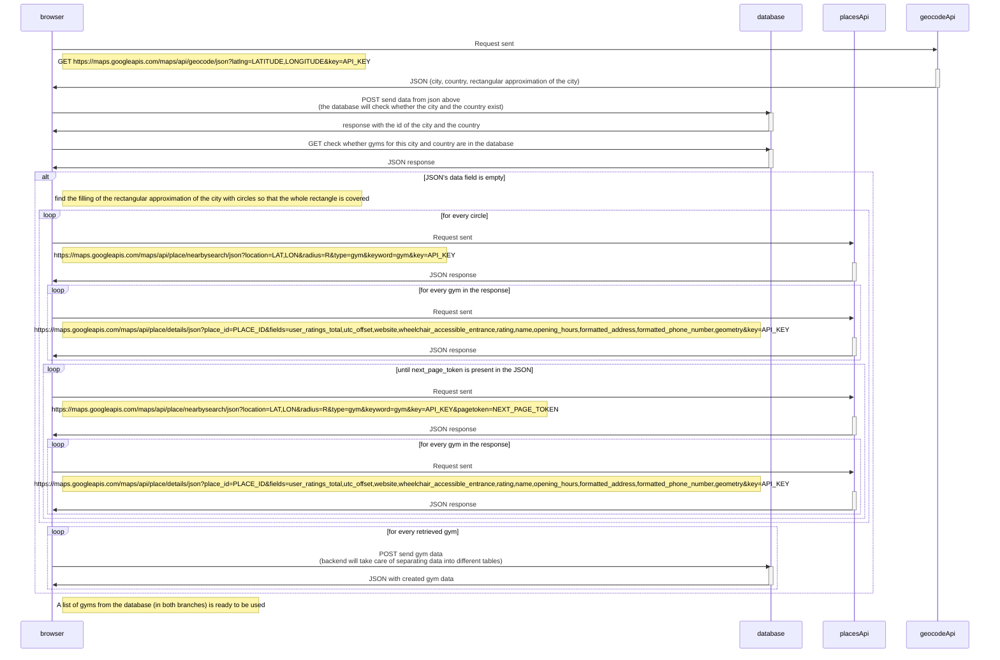

```mermaid
sequenceDiagram
    participant browser
    participant database
    participant placesApi
    participant geocodeApi

    browser->>geocodeApi: Request sent
    Note right of browser: GET https://maps.googleapis.com/maps/api/geocode/json?latlng=LATITUDE,LONGITUDE&key=API_KEY
    activate geocodeApi
    geocodeApi->>browser: JSON (city, country, rectangular approximation of the city)
    deactivate geocodeApi

    browser->>database: POST send data from json above<br/>(the database will check whether the city and the country exist)
    activate database
    database->>browser: response with the id of the city and the country
    deactivate database

    browser->>database: GET check whether gyms for this city and country are in the database
    activate database
    database->>browser: JSON response
    deactivate database

    alt JSON's data field is empty
      Note right of browser: find the filling of the rectangular approximation of the city with circles so that the whole rectangle is covered
      loop for every circle
        browser->>placesApi: Request sent
        Note right of browser: https://maps.googleapis.com/maps/api/place/nearbysearch/json?location=LAT,LON&radius=R&type=gym&keyword=gym&key=API_KEY
        activate placesApi
        placesApi->>browser: JSON response
        deactivate placesApi
        loop for every gym in the response
          browser->>placesApi: Request sent
          Note right of browser: https://maps.googleapis.com/maps/api/place/details/json?place_id=PLACE_ID&fields=user_ratings_total,utc_offset,website,wheelchair_accessible_entrance,rating,name,opening_hours,formatted_address,formatted_phone_number,geometry&key=API_KEY
          activate placesApi
          placesApi->>browser: JSON response
          deactivate placesApi
        end
        loop until next_page_token is present in the JSON
          browser->>placesApi: Request sent
          Note right of browser: https://maps.googleapis.com/maps/api/place/nearbysearch/json?location=LAT,LON&radius=R&type=gym&keyword=gym&key=API_KEY&pagetoken=NEXT_PAGE_TOKEN
          activate placesApi
          placesApi->>browser: JSON response
          deactivate placesApi
          loop for every gym in the response
            browser->>placesApi:Request sent
            Note right of browser: https://maps.googleapis.com/maps/api/place/details/json?place_id=PLACE_ID&fields=user_ratings_total,utc_offset,website,wheelchair_accessible_entrance,rating,name,opening_hours,formatted_address,formatted_phone_number,geometry&key=API_KEY
            activate placesApi
            placesApi->>browser: JSON response
            deactivate placesApi
          end
        end
      end
      loop for every retrieved gym
        browser->>database: POST send gym data <br/> (backend will take care of separating data into different tables)
        activate database
        database->>browser: JSON with created gym data
        deactivate database
      end
    end

    Note right of browser: A list of gyms from the database (in both branches) is ready to be used
```
